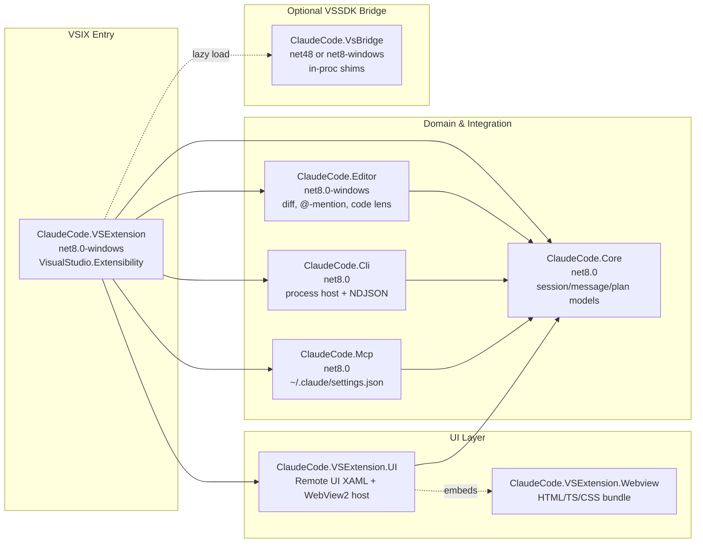
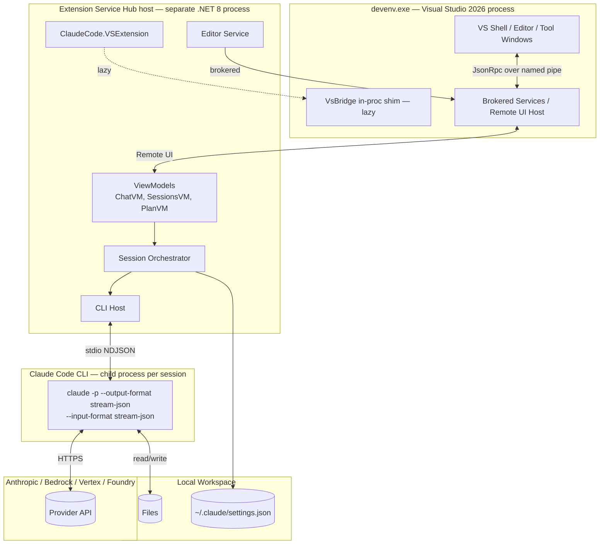
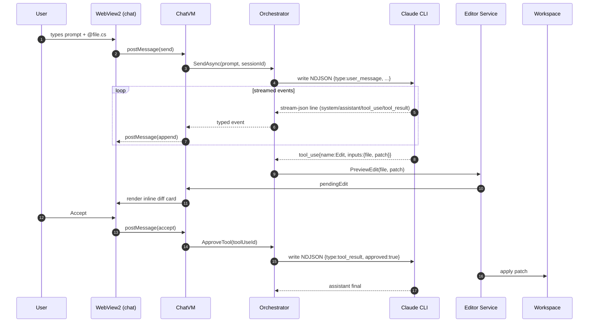

# Conduit — Project Plan

> Status: draft v0.2  •  Owner: TBD  •  Target: VS2026 + .NET 8 LTS (forward-declared net10)  •  Model: VisualStudio.Extensibility (OOP)
>
> **Conduit for Claude Code** — agentic coding inside Visual Studio. See `BRAND.md` for design tokens, `SPIKE-000-tfm.md` for runtime decision.

---

## 0. TL;DR

Build an out-of-process VS2026 extension that wraps the Claude Code CLI as a subprocess, surfaces a chat UI in a tool window via Remote UI + WebView2, and integrates with the editor for inline diffs, @-mentions with line ranges, plan mode, auto-accept, and MCP. Achieve parity with Anthropic's VS Code extension where the platform allows; substitute idiomatic VS patterns where it doesn't.

**Primary architectural decisions (decide before Phase 1):**

| Decision | Choice | Rationale |
|---|---|---|
| Extensibility model | VisualStudio.Extensibility (OOP) | Hot-load, .NET 10, isolation, future-proof |
| Fallback model | VSSDK in-proc bridge | For features not yet in OOP (e.g., advanced editor margins) |
| TFM | `net8.0-windows10.0.22621.0` | net10 blocked by [VSExtensibility#544](https://github.com/microsoft/VSExtensibility/issues/544); revisit Q3 2026 — see `SPIKE-000-tfm.md` |
| Chat UI | WebView2 hosted inside a Remote UI tool window | Remote UI alone can't render the chat surface at parity |
| Claude integration | CLI subprocess + NDJSON over stdio | No official C# Agent SDK |
| Solution format | `.slnx` | VS2026 native |
| DI/MVVM | `Microsoft.Extensions.DependencyInjection` + `CommunityToolkit.Mvvm` | Standard, OOP-friendly |

---

## 1. Information Extraction Process

### 1.1 Sources of Truth (authoritative, in priority order)

| # | Source | Scope | Refresh |
|---|---|---|---|
| 1 | `https://learn.microsoft.com/en-us/visualstudio/extensibility/visualstudio.extensibility/` | OOP SDK reference, samples, limitations | Weekly |
| 2 | `https://github.com/microsoft/VSExtensibility` | Sample repo, issue tracker (real platform gaps live here) | Weekly + RSS on releases |
| 3 | `https://devblogs.microsoft.com/visualstudio/tag/visualstudio-extensibility/` | Release notes per VS minor (17.x → VS2026 equivalents) | On post |
| 4 | `https://code.claude.com/docs/en/vs-code` | Anthropic's own extension feature surface — parity target | Bi-weekly |
| 5 | `https://code.claude.com/docs/en/headless` | CLI flags, output formats, session model | Bi-weekly |
| 6 | `https://github.com/anthropics/claude-code/releases` | Behavior and CLI flag changes | On release |
| 7 | `https://learn.microsoft.com/en-us/visualstudio/extensibility/visualstudio.extensibility/inside-the-sdk/remote-ui` | Remote UI constraints (the constraint that hurts most) | On change |
| 8 | NuGet: `Microsoft.VisualStudio.Extensibility.Sdk`, `.Build`, `.Editor` | Authoritative API surface; check version notes | Per VS minor |
| 9 | `https://learn.microsoft.com/en-us/answers/tag/visualstudio-extensibility` | Real-world gotchas the docs miss (e.g., WebView2 in Remote UI) | Weekly |
| 10 | `https://github.com/dliedke/ClaudeCodeExtension` | Prior art (VSSDK-based) — borrow patterns, avoid pitfalls | On commit |

### 1.2 Extraction Workflow

1. **Snapshot script** (`tools/refresh-context.ps1`) iterates the source list, fetches markdown via Claude Code's headless mode (`claude -p "Summarize the changes since YYYY-MM-DD at <url> and emit a delta in markdown" --output-format json`), writes results to `docs/context/<source>-YYYY-MM-DD.md`.
2. **Diff against last snapshot**, append a single rolling delta to `docs/context/CHANGELOG.md`.
3. **Tag the delta** with `breaking | additive | informational` so phase exit reviews pull only what's relevant.
4. **Manual triage** weekly: anything tagged `breaking` opens a spike in the active phase.

### 1.3 Document deliverables under `/docs`

```
/docs
  PROJECT_PLAN.md            (this file)
  ARCHITECTURE.md            (software architecture + mermaid)
  PROJECT_STRUCTURE.md       (csproj layout + mermaid)
  PARITY_MATRIX.md           (Anthropic VS Code feature → VS2026 mapping)
  /context
    CHANGELOG.md
    learn.microsoft.com-*.md
    code.claude.com-*.md
    ...
  /spikes
    SPIKE-001-webview2-in-remote-ui.md
    SPIKE-002-cli-stream-json.md
    ...
```

---

## 2. C# / .NET Project Architecture

### 2.1 TFM and runtime

- **TFM**: `net8.0-windows10.0.22621.0`. Originally we wanted `net10.0-windows` for forward-compat through Nov 2028, but `Microsoft.VisualStudio.Extensibility.Sdk` does not yet host on .NET 10 — see `SPIKE-000-tfm.md`. **Forward-declare** net10 in `ExtensionMetaData.DotnetTargetVersions` so the bump is mechanical when the SDK moves.
- **LTS reality**: .NET 8 LTS ends **Nov 2026**. `SPIKE-100-runtime-bump` is a Q3 2026 ticket, not "as needed."
- **Solution format**: `.slnx`.
- **Code style**: `Nullable=enable`, file-scoped namespaces, `LangVersion=latest` (gets C# 12 on net8), `TreatWarningsAsErrors=true` outside test projects.

### 2.2 Solution layout

```
ClaudeCode.VS2026.slnx
├── src/
│   ├── ClaudeCode.VSExtension/                  (VSIX entry point — VisualStudio.Extensibility OOP)
│   ├── ClaudeCode.VSExtension.UI/               (Remote UI controls + WebView2 host XAML)
│   ├── ClaudeCode.VSExtension.Webview/          (TS/HTML/CSS chat surface, built into a single bundle)
│   ├── ClaudeCode.Core/                       (domain: sessions, messages, plans, tool calls)
│   ├── ClaudeCode.Cli/                        (Claude CLI process host + NDJSON parser)
│   ├── ClaudeCode.Mcp/                        (MCP config read/write — defers to ~/.claude/settings.json)
│   ├── ClaudeCode.Editor/                     (editor integrations: diff apply, @-mention, code lens)
│   └── ClaudeCode.VsBridge/                   (in-proc VSSDK bridge for any feature gaps; loaded lazily)
├── tests/
│   ├── ClaudeCode.Core.Tests/                 (xUnit; pure unit)
│   ├── ClaudeCode.Cli.Tests/                  (NDJSON fixtures + golden files)
│   └── ClaudeCode.VSExtension.IntegrationTests/ (runs against Experimental Instance)
├── docs/                                      (see §1.3)
├── tools/                                     (refresh-context.ps1, build helpers)
└── samples/                                   (manual-test workspaces)
```

### 2.3 Project dependency graph



Why `VsBridge` exists: the OOP model still has gaps (e.g., some advanced editor margins, certain commanding scenarios). When we hit one, we add a thin VSSDK in-proc shim and call it via brokered service. Keeps OOP-first while not blocking on Microsoft's roadmap.

---

## 3. Software Architecture

### 3.1 Runtime topology



### 3.2 Component responsibilities

| Component | Responsibility | Notes |
|---|---|---|
| `ClaudeCode.VSExtension` | DI composition root, registers commands, tool window, contributions | One `Extension` class with `[VisualStudioContribution]` attributes |
| `Session Orchestrator` | Owns N concurrent `ClaudeSession` instances; routes events to UI | One CLI process per session; preserve `session_id` on resume |
| `CLI Host` | Spawn `claude`, write input frames, parse `stream-json` line-by-line | Use `System.IO.Pipelines` for backpressure; `System.Text.Json` source generators for hot path |
| `Chat ViewModel` | Streamed message blocks → observable collection bound to webview via `postMessage` | `CommunityToolkit.Mvvm` source generators |
| `WebView2 host` | Single Remote UI XAML hosting `WebView2`; bridges via `CoreWebView2.WebMessageReceived` | Static assets shipped with the extension; CSP locked down |
| `Editor Service` | Apply edits as inline diffs (accept/reject), resolve `@file:start-end` mentions, optional code lens | Uses VS.Extensibility editor APIs; falls back to `VsBridge` if needed |
| `MCP` | Read/write user MCP server list in `~/.claude/settings.json`, surface as settings UI | Don't reimplement MCP — defer to CLI |
| `VsBridge` | In-proc shims for any OOP gap | Loaded only when invoked |

### 3.3 Key flow — user sends a message that edits files (Plan Mode + Auto-Accept off)



### 3.4 Threading & async rules

- All Remote UI callbacks are async — no `.Result` / `.Wait()`.
- CLI stdio reader is a single dedicated `Task` per session, parsing line-by-line with `PipeReader`.
- UI binding on the Remote UI side is automatically marshalled by VS — but mutations must come from the orchestrator's dispatcher.
- Cancel propagation: `CancellationToken` plumbed top-to-bottom; `Esc` in the chat sends SIGINT-equivalent (`tool_cancel` frame) to CLI.

---

## 4. Phased Roadmap with Risk Spikes

Every phase has: **deliverable**, **exit criteria**, and a **spike artifact** for any unknown that could derail it. Spikes are throwaway — their job is to retire risk, not produce production code.

### Phase 0 — Foundation (1–2 days)
- **Deliverable**: solution skeleton, CI build, Experimental Instance launch, empty tool window appears.
- **Exit**: `F5` opens Experimental, "Conduit" tool window shows "Hello".
- **Risks / Spikes**:
  - **SPIKE-000-tfm**: ✅ **closed 2026-04-22** — see `SPIKE-000-tfm.md`. TFM pinned to `net8.0-windows10.0.22621.0`, net10 forward-declared in metadata. Bump triggered by [VSExtensibility#544](https://github.com/microsoft/VSExtensibility/issues/544) closing or .NET 8 LTS sunset (Nov 2026).
  - **SPIKE-100-runtime-bump**: scheduled for Q3 2026 regardless of #544 status — .NET 8 LTS ends in Nov.

### Phase 1 — Chat UI shell (3–5 days)
- **Deliverable**: WebView2 inside Remote UI tool window, two-way `postMessage` bridge, dummy "echo" backend.
- **Exit**: Type in webview, message appears in `Output → Claude Code` window via the bridge.
- **Risks / Spikes**:
  - **SPIKE-001-webview2-in-remote-ui**: Prove WebView2 works inside a Remote UI tool window in OOP (Microsoft Q&A says yes; verify on current SDK). Artifact: minimal sample VSIX.
  - **SPIKE-002-csp-and-assets**: How are static assets resolved (`SetVirtualHostNameToFolderMapping` works OOP?). Artifact: documented asset-loading approach.

### Phase 2 — CLI integration (3–4 days)
- **Deliverable**: spawn `claude -p --input-format stream-json --output-format stream-json --include-partial-messages --verbose`, stream both directions, render assistant text live in webview.
- **Exit**: Plain prompt → streamed Markdown response in chat.
- **Risks / Spikes**:
  - **SPIKE-003-cli-stream-json**: Pin the JSON event schema; capture golden-file fixtures of every event type. Artifact: `tests/fixtures/*.ndjson` + parser.
  - **SPIKE-004-resume**: Verify `--resume <session_id>` round-trips full context. Artifact: 20-line test.

### Phase 3 — Auth & multi-provider (2 days)
- **Deliverable**: first-run flow detects no login, runs `claude /login` in integrated terminal; settings UI for Bedrock/Vertex/Foundry.
- **Exit**: Sign in via browser; provider selection persists.
- **Risks / Spikes**:
  - **SPIKE-005-terminal-handoff**: Best way to invoke the integrated terminal from OOP. May need `VsBridge`. Artifact: working command.

### Phase 4 — Editor integration: @-mentions & inline diffs (4–6 days)
- **Deliverable**: `Alt+K` inserts `@file.cs#start-end` from selection; CLI `Edit` tool calls render as inline diff cards with Accept/Reject; on accept, patch applied via editor APIs.
- **Exit**: Ask Claude to rename a method; see diff in chat **and** as a peek-style view in editor; accept applies it.
- **Risks / Spikes**:
  - **SPIKE-006-inline-diff-rendering**: Can VS.Extensibility editor APIs render an inline diff adornment, or do we need `VsBridge`? Artifact: prototype + decision memo.
  - **SPIKE-007-mention-resolver**: How to enumerate workspace files efficiently in OOP for `@`-autocomplete. Artifact: file-index service.

### Phase 5 — Plan mode & permissions (3 days)
- **Deliverable**: mode toggle (Default / Plan / Auto-Accept), maps to CLI flags / runtime mode switch; render `exit_plan_mode` plans with Edit + Approve.
- **Exit**: Shift+Tab cycles modes; plans editable before approval.

### Phase 6 — Sessions, history, multi-tab (3 days)
- **Deliverable**: sessions list (Activity Bar entry), open multiple sessions in tabs, persistence via `~/.claude` session store.
- **Exit**: Two concurrent chats, switch and resume.
- **Risks / Spikes**:
  - **SPIKE-008-multiwindow-toolwindow**: VS.Extensibility tool window multiplicity model. Artifact: confirm or document the workaround (one tool window with internal tabs vs N tool window instances).

### Phase 7 — MCP, slash commands, plugins UI (3 days)
- **Deliverable**: settings panel reads/writes MCP block in `~/.claude/settings.json`; `/plugins` opens plugin manager surface (defers to CLI for source of truth).
- **Exit**: Add an MCP server, see it light up in chat.

### Phase 8 — Status bar, command palette, keybindings (2 days)
- **Deliverable**: status bar item showing model + session, command palette entries ("Claude Code: Open in sidebar", "New session", etc.), default keybindings matching VS Code where possible.
- **Exit**: All commands discoverable via Ctrl+Q.

### Phase 9 — Polish, theming, accessibility (3–4 days)
- **Deliverable**: dark theme tokens (per `BRAND.md`) wired through webview CSS variables and Remote UI XAML brushes via the two generators; keyboard nav; screen-reader labels.
- **Exit**: Looks correct in VS dark and high-contrast (light deferred to v2 per `BRAND.md` scope cut); passes `axe` against the webview.

### Phase 10 — Packaging, marketplace, telemetry (2 days)
- **Deliverable**: signed VSIX, marketplace listing draft as "Conduit for Claude Code", opt-in telemetry (no prompt content).
- **Exit**: Hot-loaded install on a clean VS2026, no restart required.
- **Risks / Spikes**:
  - **SPIKE-009-branding**: ✅ resolved — own brand, see `BRAND.md`. Marketplace title makes the dependency on Anthropic's Claude Code CLI explicit; no use of Anthropic marks.

### Cross-cutting spikes (run as needed)
- **SPIKE-100-runtime-bump**: Process for moving `net10.0` → next LTS without breaking installed extensions.
- **SPIKE-101-vssdk-bridge**: First time we hit an OOP gap — codify the bridge pattern.

---

## 5. Feature Parity Matrix (high level — full detail in `PARITY_MATRIX.md`)

| Anthropic VS Code feature | VS2026 approach | Status |
|---|---|---|
| Spark icon in Activity Bar → sessions | Tool window + activity-bar-equivalent placement | Direct |
| Sidebar / secondary sidebar / drag | Tool window placement (`DocumentWell`, `Floating`, etc.) | Direct (different idiom) |
| Sign-in browser flow | Delegate to `claude /login` in terminal | Direct |
| Conversation history | Read `~/.claude` session store | Direct |
| Multiple sessions in tabs | One tool window per session OR internal tabs (Spike 008) | TBD |
| Plan mode + edit plans | UI mode toggle + render `exit_plan_mode` | Direct |
| Auto-accept edits | Mode toggle → omit approval prompts | Direct |
| @-mention with line ranges | `Alt+K` + selection → `@path#a-b` token | Direct |
| Inline diffs accept/reject | Editor adornment + chat card | Direct (Spike 006) |
| MCP server config UI | Settings panel writing `~/.claude/settings.json` | Direct |
| Slash commands | Pass-through to CLI; client-side autocomplete | Direct |
| `/plugins` UI | Render CLI's plugin output; basic install/toggle | Partial |
| Status bar Claude Code | VS.Extensibility status bar API | Direct |
| Extended thinking toggle | UI toggle → CLI flag / runtime command | Direct |
| Image paste / file attach | WebView2 paste handler → CLI image input | Direct |

---

## 6. Things You Might Be Missing

1. **Mads's "Extensibility Essentials 2022" is VSSDK-era.** Its templates are in-proc. Use Microsoft's `Microsoft.VisualStudio.Extensibility.Templates` for the OOP main project. Keep Mads's pack installed for VSSDK side-projects (it remains the best DX for the in-proc bridge).
2. **Branding resolved** — own brand "Conduit" (see `BRAND.md`). Marketplace title "Conduit for Claude Code" makes the integration explicit without using Anthropic marks. Distinct icon (signal waveform) and palette (teal/rose on deep slate) avoid visual confusion with Anthropic's own VS Code extension.
3. **No first-party C# Agent SDK.** Wrapping the CLI is the only realistic path right now. If Anthropic ships one (watch the releases feed), we wrap or replace `ClaudeCode.Cli` with no other layer changes.
4. **Remote UI is not WPF.** Single-XAML, no code-behind, no custom controls referenced. WebView2 is the parity-grade chat surface — plan for it from day one, not as a retrofit.
5. **Hot-load is a feature, not a bonus.** Avoid static singletons that capture VS process state; assume the extension can be enabled/disabled mid-session without a restart.
6. **`.NET 10` vs `.NET 8`.** ✅ resolved — `SPIKE-000-tfm.md`. SDK pins us to .NET 8 today; .NET 8 LTS sunsets Nov 2026, so `SPIKE-100-runtime-bump` is calendared, not contingent.
7. **Session storage lives outside the extension.** `~/.claude` is the source of truth (sessions, settings, MCP). The extension is a view layer over it — do not duplicate state.
8. **Permission/Auto mode safety.** If we ever surface "auto mode" UX, reproduce Anthropic's classifier guardrails or be explicit that we don't have them. This is a user-trust issue, not a parity bullet.
9. **Telemetry & prompt content.** VS extensions can collect telemetry; prompt bodies and code snippets must never leave the user's machine via our pipeline. Lock this in policy before Phase 10.
10. **Prior art — `dliedke/ClaudeCodeExtension`.** Read it before Phase 1. It uses VSSDK, not OOP, but its CLI-wrapping patterns and UX choices are a free design review.

---

## Appendix A — Build & dev loop

- Open `ClaudeCode.VS2026.slnx` in VS2026.
- `F5` launches Experimental Instance with the extension loaded (hot-load — no restart on rebuild for OOP).
- Webview asset rebuild: `npm run dev` in `src/ClaudeCode.VSExtension.Webview` runs Vite in watch mode; the host picks up via `SetVirtualHostNameToFolderMapping`.
- Tests: `dotnet test` for unit; integration tests use the VS2026 ExperimentalInstance harness.

## Appendix B — Open questions to close in Phase 0

- [x] ~~Confirm `net10.0` TFM availability in current VS.Extensibility SDK.~~ → blocked, see SPIKE-000.
- [ ] Confirm `WebView2` works in OOP Remote UI tool window on current VS2026 build → SPIKE-001.
- [ ] Confirm process for invoking integrated terminal from OOP extension → SPIKE-005.
- [x] ~~Branding/legal go-no-go on name + icon.~~ → resolved: own brand "Conduit", see `BRAND.md`.
